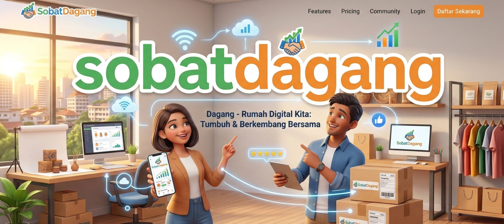

# Sobat Dagang



## 🚀 Coming Soon

Platform katalog & marketplace digital untuk pelaku UMKM, vendor, dan perusahaan Indonesia.

## 📋 Tentang Proyek

**Sobat Dagang** adalah platform digital yang memudahkan UMKM, vendor, dan perusahaan untuk:

- Mendaftarkan usaha secara mandiri
- Memamerkan produk dagangan
- Terhubung dengan lebih banyak pelanggan

## ✨ Fitur yang Akan Hadir

### 🏪 Profil Usaha

Daftarkan usahamu secara mandiri dengan profil lengkap — nama, deskripsi, alamat, dan kontak.

### 📦 Katalog Produk

Tampilkan detail produk daganganmu dengan foto, harga, dan deskripsi lengkap di etalase digital.

### 🔗 Link Marketplace

Hubungkan toko online-mu di Shopee, Tokopedia, dan marketplace lainnya dalam satu halaman.

### 📍 Lokasi & Alamat

Tampilkan lokasi usahamu agar pelanggan lebih mudah menemukan dan mengunjungi tokomu.

## 📊 Kenapa UMKM?

- **65M+** Pelaku UMKM di Indonesia
- **61%** Kontribusi PDB Nasional
- **97%** Total Pelaku Usaha
- **∞** Peluang Bertumbuh

## 🛠️ Teknologi

- **Frontend**: HTML5, CSS3, JavaScript (Vanilla)
- **Font**: Plus Jakarta Sans
- **SEO**: Open Graph, Twitter Card, Schema.org JSON-LD
- **Progressive**: Web App Manifest, robots.txt, sitemap.xml

## 📂 Struktur File

```
comingsoon-sobatdagang/
├── index.html          # Halaman coming soon
├── robots.txt          # Robot crawling rules
├── sitemap.xml         # XML sitemap dengan image indexing
├── manifest.json       # Web app manifest untuk PWA
├── image/
│   ├── logo.png        # Logo Sobat Dagang
│   └── header.jpeg     # Header banner untuk SEO
└── README.md           # Dokumentasi proyek
```

## 🌐 Domain

**Live Preview**: [https://sobatdagang.com](https://sobatdagang.com)

## 📧 Kontak

Untuk informasi lebih lanjut atau kerjasama, silakan hubungi kami melalui:

- 📷 Instagram
- 💬 WhatsApp
- 👥 Facebook
- ✉️ Email

---

© 2026 **SobatDagang.com** — Etalase Digital UMKM Indonesia
